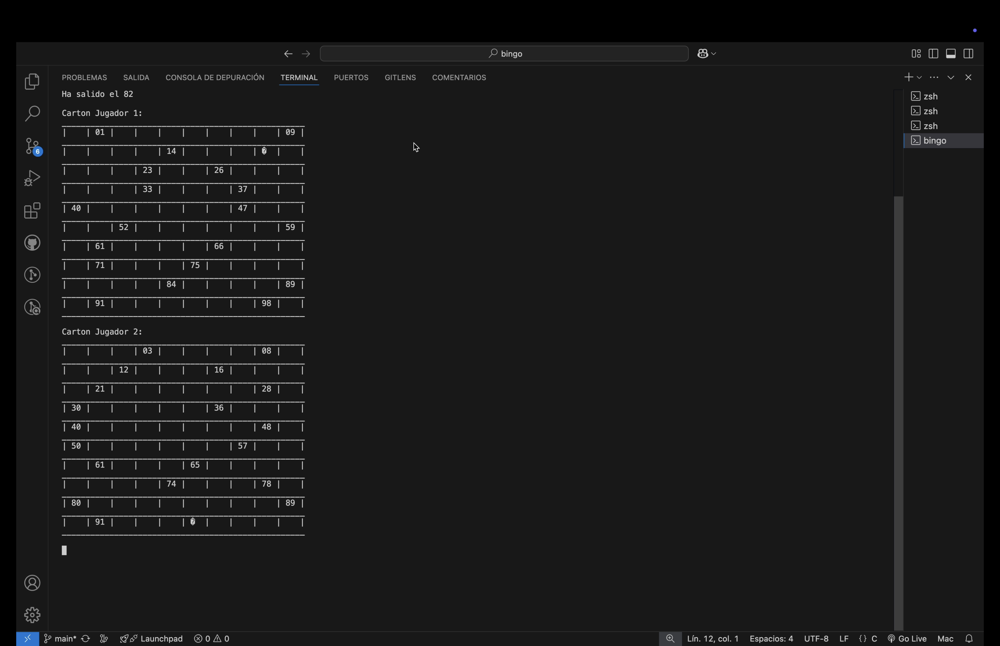

# Simulador de Bingo en C

[🇬🇧 Read in English](README.md)

## Video de demostración

[Ver el video de demostración](https://youtu.be/t-Mx-mWwi7g)

## Captura de pantalla

<p align="center">
    
</p>

## Descripción del proyecto

Este es un programa en **C** desarrollado para la asignatura "Fundamentos de la Programación" de la **Universitat Oberta de Catalunya (UOC)**. Simula una partida de bingo entre dos jugadores directamente en la terminal.

El programa crea dos cartones de bingo, extrae números aleatorios del 0 al 99, marca los aciertos de cada jugador y termina cuando uno de los jugadores completa los 20 números de su cartón. Si ambos jugadores completan sus cartones en la misma extracción, la partida termina en empate.

## Cómo funciona

1. Se inicializan tres arrays de 100 posiciones con `-1`: el cartón del jugador 1, el cartón del jugador 2 y el tablero de números extraídos.
2. Cada jugador recibe 20 números aleatorios, distribuidos dentro del rango 0-99.
3. Se muestran en la terminal los tableros vacíos iniciales y después los cartones generados.
4. El programa extrae números aleatorios sin repetirlos.
5. Cuando un número extraído aparece en el cartón de un jugador, se marca con el carácter de bloque ASCII.
6. La simulación continúa hasta que el jugador 1, el jugador 2 o ambos jugadores alcanzan 20 aciertos.
7. Se muestra el tablero final de números extraídos y se anuncia el resultado.

## Compatibilidad

El código fuente incluye pequeñas secciones específicas por plataforma para que el mismo programa pueda ejecutarse en distintos sistemas operativos:

- **Windows:** usa `Sleep()` y `cls`.
- **macOS/Linux:** usa `usleep()` y `clear`.

## Requisitos

Solo necesitas un compilador de C como **GCC**.

### Windows

```sh
gcc -o Bingo.exe Bingo.c
./Bingo.exe
```

### macOS/Linux

```sh
gcc -o Bingo Bingo.c
./Bingo
```

## Contenido del repositorio

- `Bingo.c`: código fuente principal.
- `img/bingo.png`: captura de pantalla del programa en ejecución.
- `README.md`: documentación en inglés.
- `README_es.md`: documentación en español.

## Autor

Desarrollado por **Raul Estevez** como parte de un ejercicio de programación estructurada en **C**.

## Licencia

Actualmente este repositorio no incluye ningún archivo de licencia.
